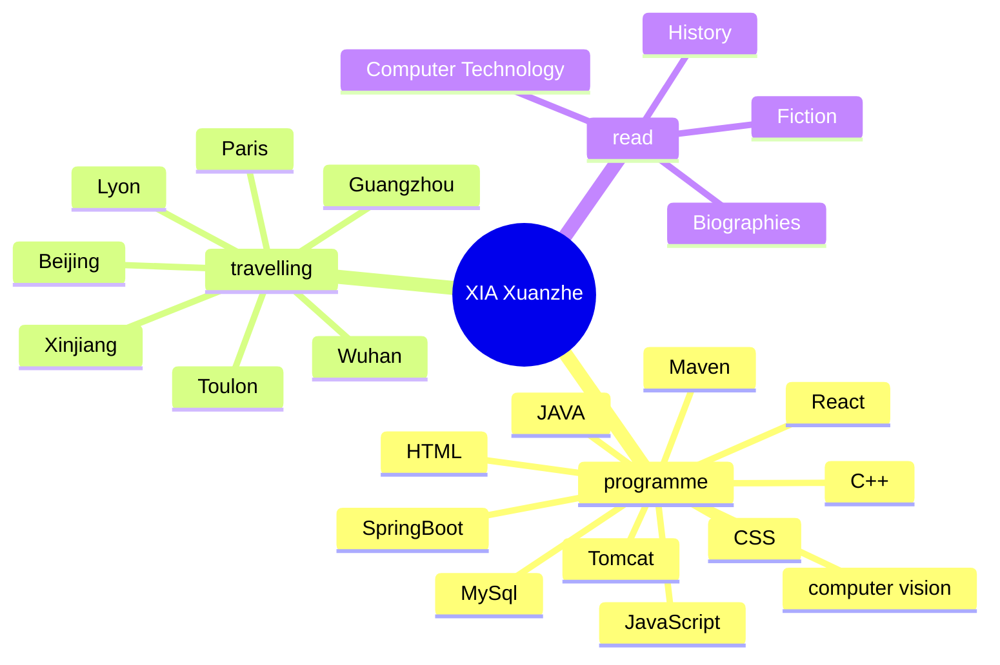

  
  <!-- dynamic typing effect 动态打字效果 -->
  

    
  

  <!-- knock code pictures 敲代码的图片 -->
   

  <!-- profile logo 个人资料徽标 -->
  

    &emsp;

  

### 🙋 Hello

<table>
<tr><td>

### 🤺 About Me

&emsp;&emsp;Hello, I'm XIA Xuanzhe.

&emsp;&emsp;Passionate about programming, music, reading and 
&emsp;&emsp;travelling.
 
&emsp;&emsp;Passionate about computer science and aspire to be
 
&emsp;&emsp;a great developer and data analyst.
  

<strong>&emsp;&emsp;We're making the world a better place. Through constructing elegant hierarchies for maximum code reuse and extensibility.</strong>

</td></tr>

<tr>
<td>
  
### 🏢 Work Experience

- [laboratoire EMGCU](https://emgcu.univ-gustave-eiffel.fr/) &emsp; 📌 2023-04-03 —— 2023-08-31
  
  - Internship Theme: Testing and validation of structural assessment software 
  - Technologies: Qt, C++, Civil engineering knowledge (fatigue, extrapolation, effet...)

- [Laboratoire d'Informatique Gaspard-Monge - UMR CNRS 8049](https://siteigm.univ-mlv.fr/) &emsp; 📌 2024-04-15 —— 2024-09-15

  - Communicate with sensor suppliers, collect sensor information, select appropriate sensors and master sensor deployment methods.
  - Analyze sensor data
  - Create deep learning models to make predictions on data
  - Compare and summarize model performance
  - Write conference paper

</td></tr>
</table>

💪 Learning

🧠 planned learning

🧰 Commonly used tools

<table align="center">
  <tr>
    <td></td>
  </tr>
</table>

  

 

